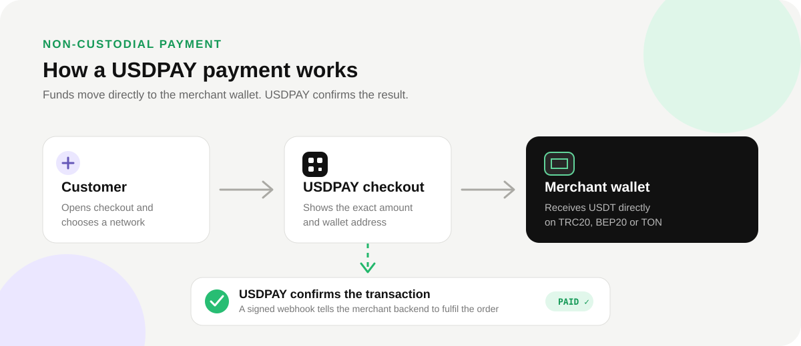

# USDPAY

**Non-custodial USDT payment infrastructure for online businesses.**

[Website](https://usdpay.me) · [API documentation](https://usdpay.me/docs) · [Pricing](https://usdpay.me/pricing) · [Security](https://usdpay.me/security) · [Service status](https://usdpay.me/status)

USDPAY helps merchants create hosted payment pages, accept USDT directly to wallets they control, and automate payment confirmation through an API and signed webhooks.

Supported payment networks:

- TRON — USDT TRC20
- BNB Smart Chain — USDT BEP20
- TON — USDT on TON

USDPAY never asks for private keys or seed phrases and does not receive or custody merchant funds.



## What you can build

- Hosted USDT checkout for a website or SaaS product
- Payment links that can be shared manually
- Automated payments inside a Telegram bot
- Order fulfilment triggered by signed webhooks
- Multi-store payment flows from one merchant account

## How a payment works

1. Your backend creates an invoice through the USDPAY API.
2. The customer opens the hosted checkout and chooses an available network.
3. The customer sends the exact USDT amount directly to your wallet.
4. USDPAY observes the supported blockchain and confirms the invoice.
5. Your backend receives a signed webhook and fulfils the order idempotently.

## Quick start

Create a store and a secret API key in the [USDPAY dashboard](https://usdpay.me/dashboard), then create an invoice from a trusted backend:

```bash
curl --request POST https://usdpay.me/api/invoices \
  --header "Authorization: Bearer YOUR_SECRET_KEY" \
  --header "Content-Type: application/json" \
  --header "Idempotency-Key: order-1044" \
  --data '{
    "amount": "49.00",
    "orderId": "ORDER-1044",
    "callbackUrl": "https://merchant.example/usdpay/webhook",
    "returnUrl": "https://merchant.example/orders/1044"
  }'
```

The response contains the invoice identifier and hosted checkout URL. Keep secret keys on the server; never place them in browser or mobile application code.

See [`examples/create-invoice.mjs`](examples/create-invoice.mjs) for a Node.js example and [`openapi/openapi.json`](openapi/openapi.json) for the complete public API contract.

## Node.js helper

This repository contains a small dependency-free Node.js client:

```js
const { UsdpayClient } = require("./sdk/node");

const usdpay = new UsdpayClient({
  secretKey: process.env.USDPAY_SECRET_KEY,
});

const invoice = await usdpay.createInvoice(
  {
    amount: "49.00",
    orderId: "ORDER-1044",
    callbackUrl: "https://merchant.example/usdpay/webhook",
  },
  { idempotencyKey: "order-1044" }
);

console.log(invoice.checkoutUrl);
```

The helper is provided as auditable integration code. It is not currently published to npm.

## Verify webhook signatures

Always verify the `X-USDPAY-Signature` header against the **raw request body** before parsing JSON or fulfilling an order:

```js
const { verifyWebhookSignature } = require("./sdk/node");

const valid = verifyWebhookSignature(
  rawBody,
  request.headers["x-usdpay-signature"],
  process.env.USDPAY_WEBHOOK_SECRET
);

if (!valid) throw new Error("Invalid USDPAY webhook signature");
```

Store and reuse the webhook idempotency key so that retrying the same event cannot fulfil an order twice. A complete framework-neutral example is available in [`examples/verify-webhook.cjs`](examples/verify-webhook.cjs).

## Security model

USDPAY is non-custodial:

- customers transfer USDT to a public wallet address controlled by the merchant;
- USDPAY monitors payment state and reports confirmation;
- private keys and seed phrases remain outside USDPAY;
- secret API keys belong only on a trusted merchant backend;
- webhook signatures authenticate events sent to the merchant.

Read the public [security overview](https://usdpay.me/security) and this repository's [security policy](SECURITY.md). Do not report vulnerabilities through a public GitHub issue.

## Repository scope

This public repository contains integration resources, examples and the public API specification. The production USDPAY platform is proprietary and is not contained in this repository. Blockchain monitoring, payment-matching, risk, billing, administration and production infrastructure implementations are intentionally private.

## Support

- Integration documentation: <https://usdpay.me/docs>
- Payment confirmation guide: <https://usdpay.me/payment-confirmation>
- Webhook guide: <https://usdpay.me/webhooks>
- Support: <support@usdpay.me>

## License

The code and examples in this repository are available under the [MIT License](LICENSE). The license does not apply to the USDPAY hosted platform, brand or proprietary production implementation.
